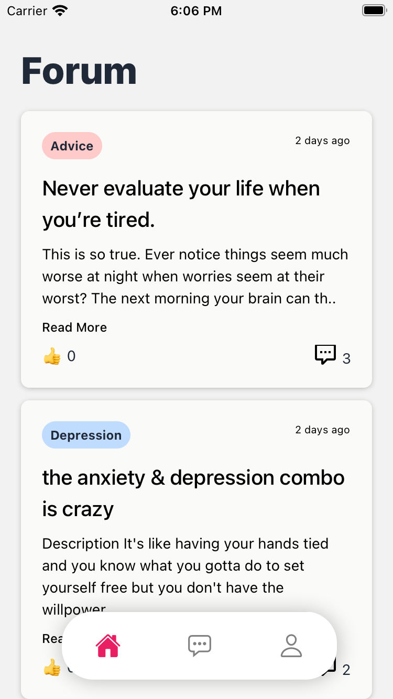
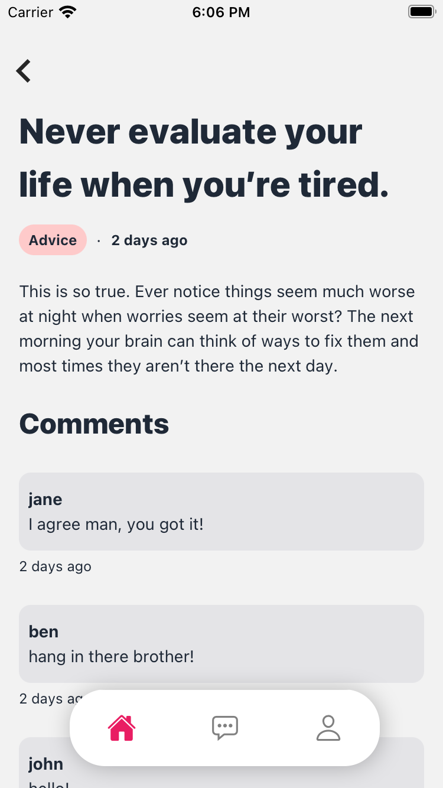
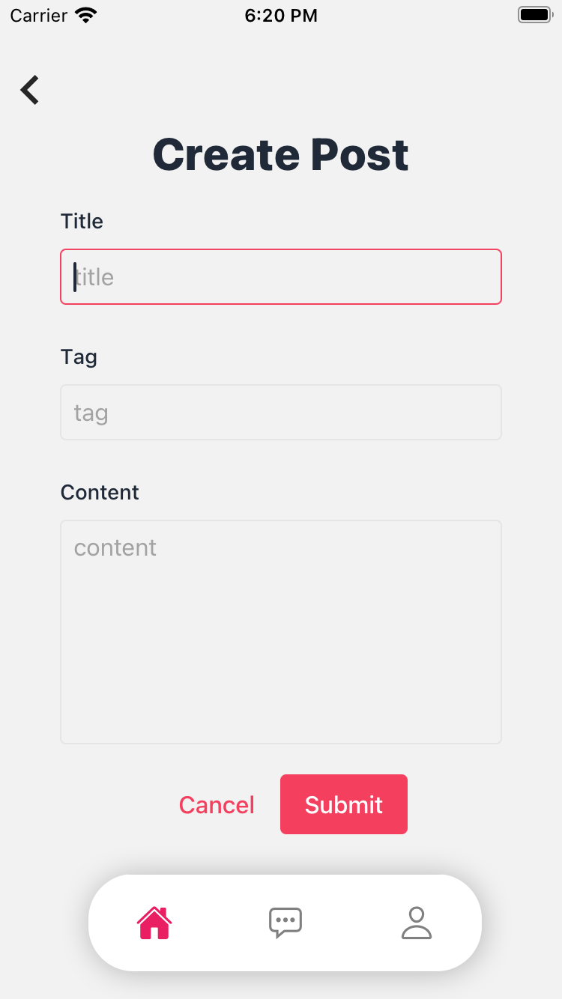
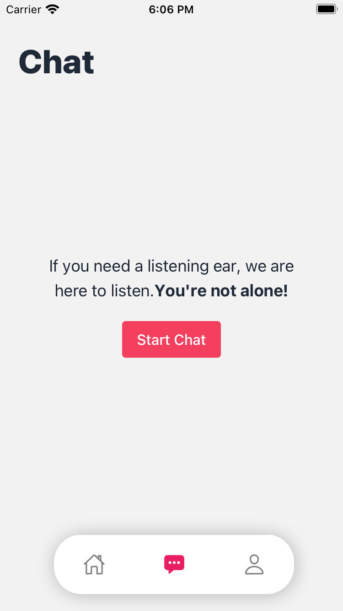
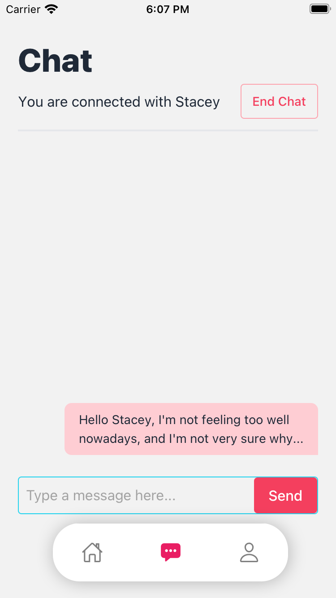
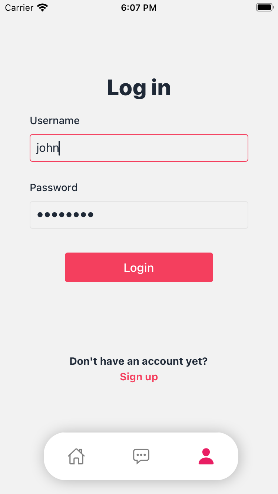

# sos.sg

Backend repository to the sos.sg mobile application. The frontend repository is available [here](https://github.com/iztanpy/sos.sg-frontend).

<strong>sos.sg</strong> is envisioned as a companion app for the Samaritans of Singapore's 24/7 [hotline](https://www.sos.org.sg/) which seeks to provide access to help for mental health. With the increased use of mobile phones of the newer generation, coupled with increased stress levels of the education system and the neoliberal society, the application re-envisions this help as a mobile application, to make mental health help even more accessible.

## Functions

The key feature of the application is the real-time chat system. It seeks to enable users to anonymously chat with a volunteer from SoS, circumventing phone call anxiety. The second feature of the application is the forum, which encourages persons afflicted with various mental issues to find a voice in a community

## Technical Aspect

The frontend of the application is built on [React Native](https://reactnative.dev/) with [Expo](https://expo.dev), with [Redux](https://redux.js.org/) as the state manager of choice. The backend of the application is built on [Express](https://expressjs.com/) and [Node](https://nodejs.org/en/), with [MongoDB](https://www.mongodb.com/) for the database. The chat system was built with web sockets using [socket.io](https://socket.io/).

## Limitations

Given the short period of time we had to build the application (24 hours), we had to rush to build an Minimum Viable Product for the showcase and judging. Therefore, the coding practices adopted was unfortunately not the best. Given more time, we would polish up the application to reduce redundancy, especially to spend more time working on state management in the frontend.

## Moving forward

We hope that in the future, we get to quicken the enforcement of forum regulations through formal recruitments of forum moderators. Improving UI flow is also a priority as we would like to provide useful links, advice, and information within the application to improve mental health literacy in Singapore. Most importantly, however, we are looking at a potential partnership with SoS and other beneficiaries in Singapore.

## Screenshots

  &nbsp;
  &nbsp;
    
  <em>Home Screen, Post Screen, Create Post Screen </em>   
  
  &nbsp;
    
  <em>Chat Screens</em>    
  
    
  <em>Login Screen</em>    

